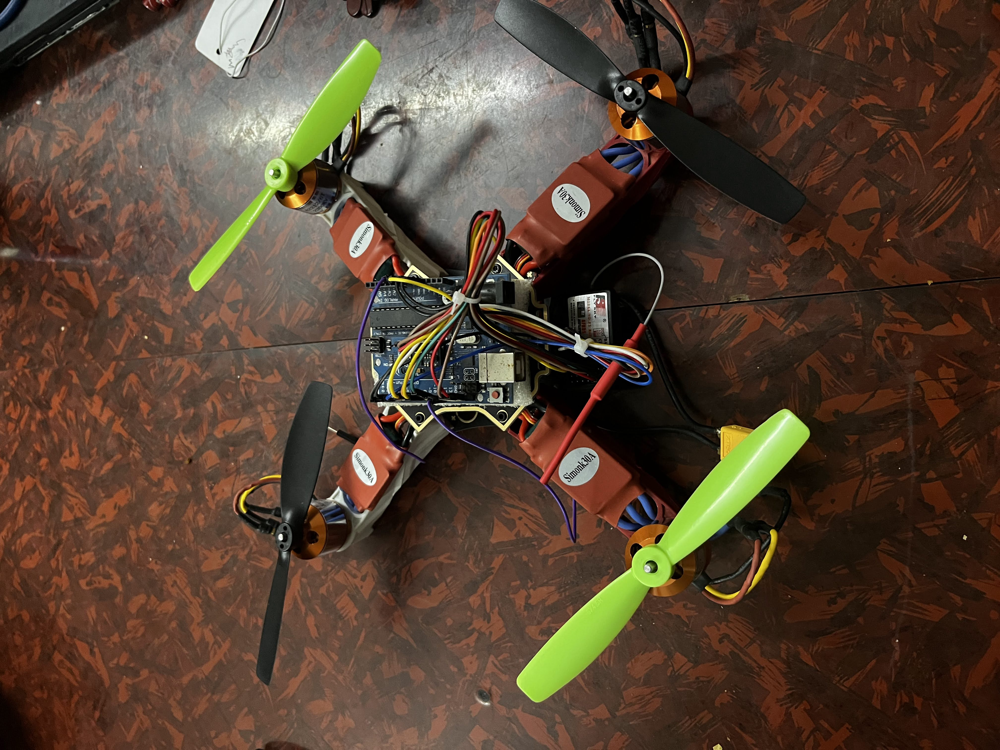

# Autonomous Drone Using OpenCV

An academic engineering project focused on a **vision-assisted, autonomous quadcopter** for **search-and-rescue and disaster response**: computer vision to locate people, navigation aids for routing, and stabilization using onboard sensors. This repository hosts project materials for **Group 14** (Mechanical Engineering, SIES Graduate School of Technology, University of Mumbai, 2022–2023).

  

  <em>Prototype hardware: custom flight stack with Arduino, Simonk 30A ESCs, brushless motors, and LiPo power (XT60).</em>

---

## Why this project

Disasters and accidents often make it **hard to rescue, track, and supply** victims—especially in tight or dangerous areas. **Autonomous drones** can operate from safer standoff distances, carry sensors that humans cannot easily deploy everywhere, and reduce panic-driven mistakes by following consistent autonomy logic. **OpenCV** adds **detection and tracking** so victims can be located from the air; **GPS / geolocation** supports routing; **grippers** (in the broader design) enable payload delivery; **gyroscope and accelerometer** feedback supports stabilization in rough conditions.

## Objectives

- **Fully autonomous flight** to reduce human error during operation  
- **Rescue support**: locate people in emergencies using **computer vision** and **GPS navigation**  
- **Deliver supplies** to remote or hard-to-reach areas using geo sensors  
- **Stabilize** the aircraft in harsh weather using **gyroscope** and **accelerometer** data  

## Proposed approach (summary)

Traditional RC-only control is replaced by a path toward **full autonomy**: **OpenCV** for perception, autonomous flight logic, thrust and frame sizing from payload and thrust calculations, **MATLAB Simulink / aerospace blocks** for simulation and tuning, and integration with a **flight computer** (e.g. Pixhawk-class stack in the report narrative, with **in-house Arduino + MultiWii** used for the built controller).

## Hardware highlights (from project design)

| Area | Choice / notes |
|------|----------------|
| **Frame** | X-configuration quadcopter; span sized from thrust/weight and payload (see Black Book for calculations) |
| **Propellers** | 6 inch |
| **Motors** | ~2300 KV brushless (matched to frame/prop) |
| **ESCs** | Simonk 30 A (pre-calibrated firmware, common in RC builds) |
| **Battery** | LiPo ~2200 mAh (paired with motor/ESC setup) |
| **Flight sensing** | MPU-6050 (gyro + accelerometer), BMP-180 barometer on Arduino FC |
| **Compute / vision** | Raspberry Pi + **Pi Camera** for OpenCV (e.g. Haar cascade face detection) |
| **Radio** | RC receiver + transmitter for manual phases and testing |

**Motor mixing** (quad X) follows standard thrust / yaw / pitch / roll superposition on the four corners; **PID** loops close the loop on attitude and altitude using sensor feedback.

## Software & tooling

- **Arduino IDE** + **MultiWii** for the custom flight controller firmware and GUI tuning  
- **OpenCV (Python)** on Raspberry Pi for camera capture and detection pipelines  
- **MATLAB Simulink** (aerospace blockset) for simulation and control development  
- **Raspberry Pi OS** setup via Raspberry Pi Imager  

## Results (from flight testing)

Initial tests validated the build end-to-end; one iteration required **ESC / motor matching** adjustments after a front-left ESC failure under overload. The team reports **in-house flight controller** integration with mechatronics and automation, with test flights reaching on the order of **~10 m altitude** (exact flight duration is noted in the full report).

## Future scope

- Deeper **OpenCV** pipelines for detection, tracking, and recognition in SAR  
- **Thermal / shape** cues and faster situational mapping for rescue  
- **Disaster assessment** imagery, **medical supply** delivery routes, and **firefighting** support with thermal + vision  

## Team & guidance

**Students:** Khushal Tayade (119A6020), Siddhesh Patil (119A6032), Tejas Kamble (119A6051), Sarvesh Vichare (119A6056)  

**Guide:** Dr. Lokpriya Gaikwad — Department of Mechanical Engineering, SIES Graduate School of Technology  

---

## Documentation in this repo

The full **project report (Black Book)** is included as a PDF with complete methodology, calculations, diagrams, bill of materials, autonomy section (including Pi Camera + OpenCV sample flow), and references:

- [`Assets/Black Book FINAL Grp 14 2.pdf`](Assets/Black%20Book%20FINAL%20Grp%2014%202.pdf)

Additional reference: [`Reserch Paper.pdf`](Reserch%20Paper.pdf) (filename as in repository).

---

*This README summarizes the submitted Black Book (Group 14). For figures, equations, simulation screenshots, and cited literature, see the PDF.*
